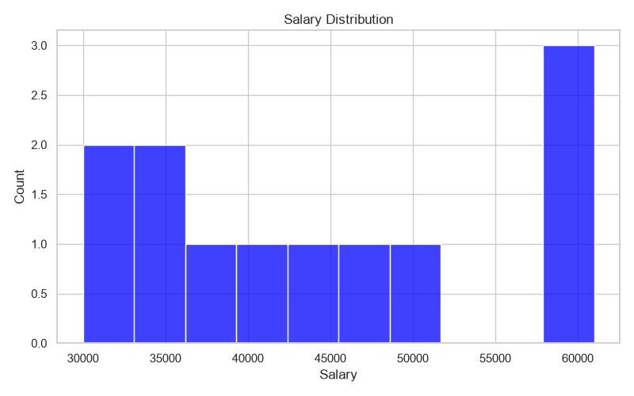
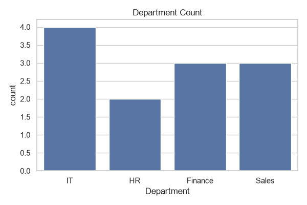
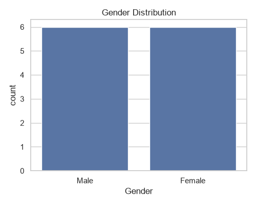
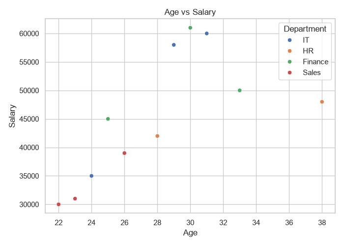
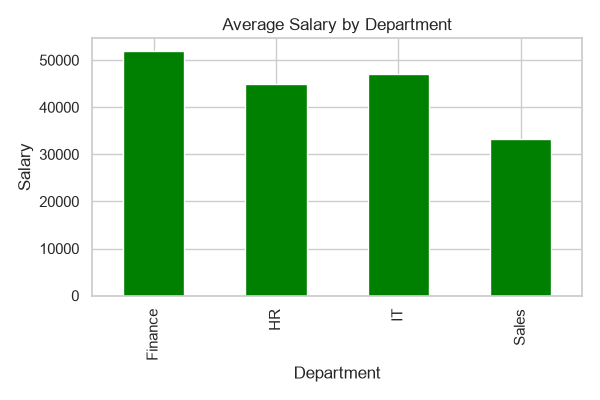

# 📊 Data Cleaning & Visualization Project

A Python project that demonstrates data cleaning, preprocessing, and data visualization using Pandas, Matplotlib, and Seaborn.

---

## 📌 Project Overview

This project performs:

- Loading raw employee data
- Cleaning missing values
- Removing duplicate records
- Data preprocessing
- Creating insightful visualizations
- Saving cleaned dataset

---

## 🛠 Technologies Used

- Python
- Pandas
- Matplotlib
- Seaborn

---

## 📂 Project Structure

```
Data-Cleaning-Visualization-Project/
│── data.csv
│── cleaned_data.csv
│── cleaning.py
│── requirements.txt
│── README.md
│── salary_distribution.png
│── department_count.png
│── gender_distribution.png
│── age_vs_salary.png
│── average_salary_by_department.png
```

---

## ▶ How to Run

### 1. Clone Repository

```bash
git clone https://github.com/bendaleheramb05/Data-Cleaning-Visualization-Project.git
```

### 2. Install Requirements

```bash
pip install -r requirements.txt
```

### 3. Run

```bash
python cleaning.py
```

---

# 📈 Output Visualizations

## 1. Salary Distribution



---

## 2. Department Count



---

## 3. Gender Distribution



---

## 4. Age vs Salary



---

## 5. Average Salary by Department



---

## 📁 Output Files

- cleaned_data.csv
- salary_distribution.png
- department_count.png
- gender_distribution.png
- age_vs_salary.png
- average_salary_by_department.png

---

## 👨‍💻 Author

**Heramb Bendale**

GitHub:
https://github.com/bendaleheramb05
